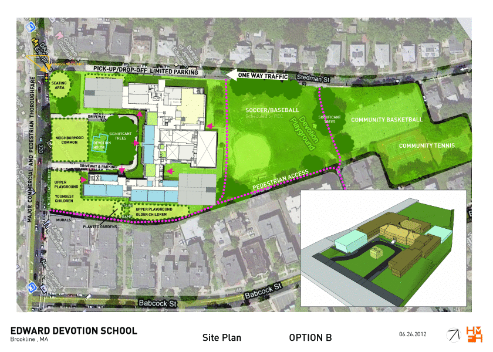
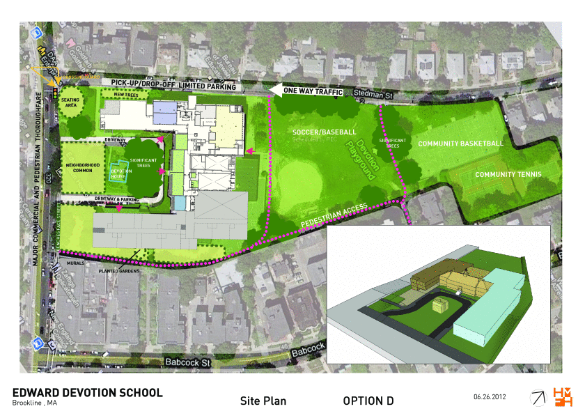
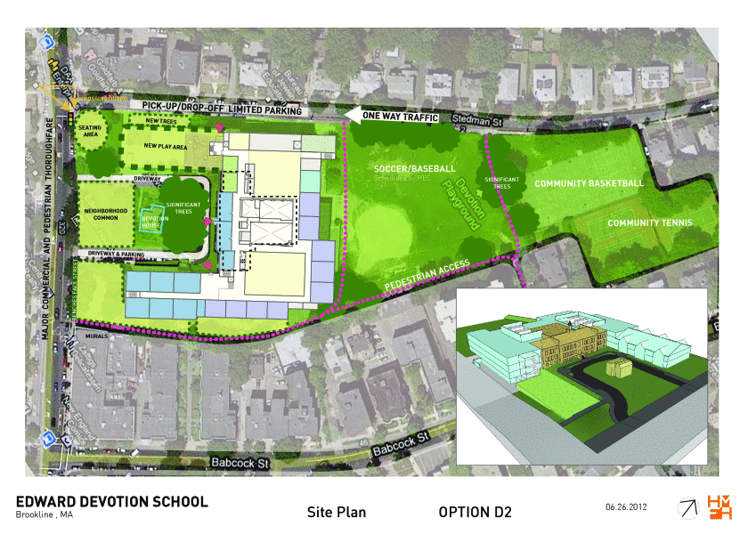

The [Devotion School Building Committee][committee] advises the town of Brookline on the project and has made available a [June 26, 2012 concept study](http://www.brooklinema.gov/index.php?option=com_docman&task=doc_download&gid=6759&Itemid=1639) on their [reports](http://www.brooklinema.gov/index.php?option=com_docman&Itemid=1639) page.

Here are some options from that PDF:

Notes to self:

    for i in a b c d d1 d2 e e1; do touch /tmp/devo/devo-concept-2012-06-26-option-$i.gif; done
    for i in 1 10 16 22 28 34 41 48 55; do convert -scale '840x600' "Devotion_School_Boards_30x42_2012_0626.pdf[$i]" out-$i.gif;done

Then mv the images into place.

[committee]: http://www.brooklinema.gov/index.php?option=com_content&view=article&id=1396&Itemid=1636
