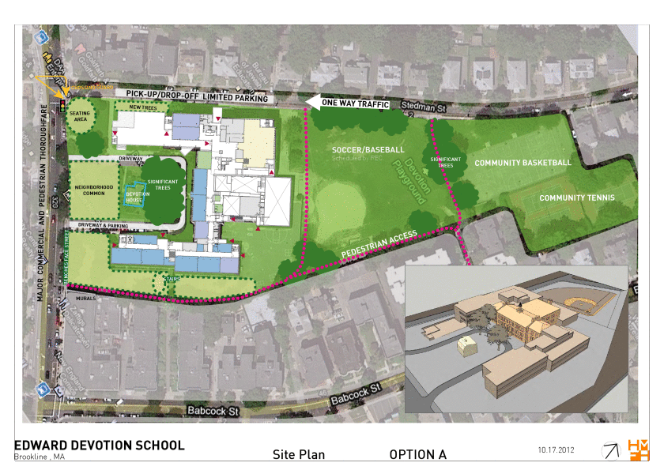
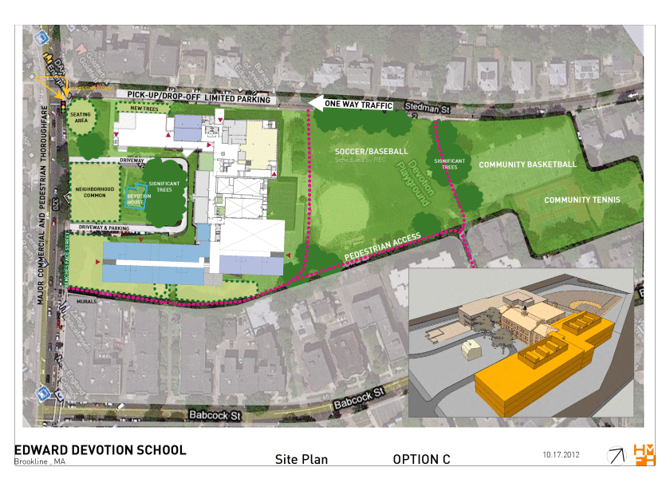
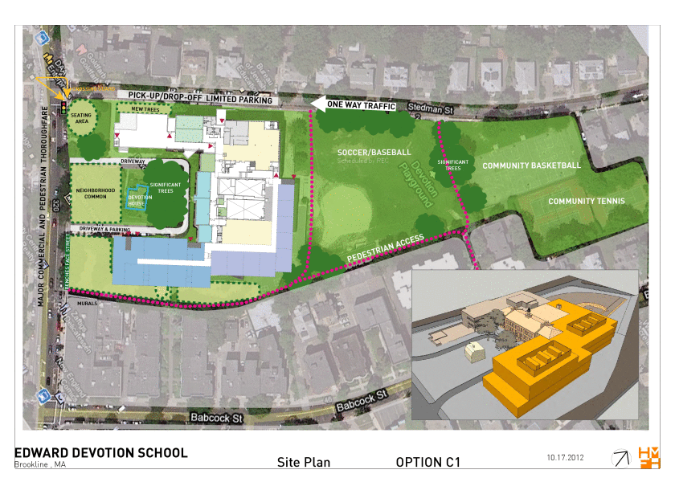

The [Devotion School Building Committee][committee] advises the town of Brookline on the project and has made available a [October 17, 2012 concept study][pdf] on their [reports](http://www.brooklinema.gov/index.php?option=com_docman&Itemid=1639) page. This version supercedes the [June 26, 2012 version](concept-study-2012-06-26)

Here are some options from the PDF that were presented at the [Devo renovation community meeting on 2012-10-17](http://coolcorn.github.com/devo/2012/10/17/renovation-community-meeting/):

Notes to self:

    for i in a b b1 c c1 d d1 e e1 f f1; do touch /tmp/devo/devo-concept-2012-10-17-option-$i.gif; done
    for i in 1 8 11 13 16 19 22 25 28 31 34 37 ; do convert -scale '840x600' "Brookline-Public-Meeting-10.17.2012.pdf[$i]" out-$i.gif;done

Then mv the images into place.

[committee]: http://www.brooklinema.gov/index.php?option=com_content&view=article&id=1396&Itemid=1636
[pdf]: http://www.brooklinema.gov/index.php?option=com_docman&task=doc_download&gid=7002&Itemid=1639
